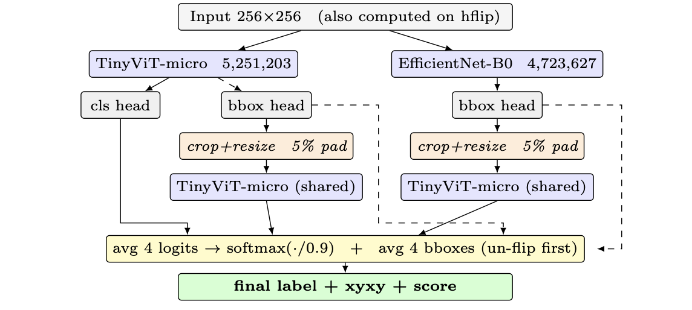

# NABirds Fine-Grained Recognition

Fine-grained recognition on **[NABirds](https://dl.allaboutbirds.org/nabirds)** (~24k labeled images, **555** categories: species and morphs). Each image has one bird. The system outputs:

- class label
- normalized box `[x_min, y_min, x_max, y_max]` in `[0, 1]`
- confidence score

Annotations use a CUB-style layout (`classes.txt`, `images.txt`, `bounding_boxes.txt`, train/val/test splits).

Best held-out score: **0.76934** · total params **9.97 M** (TinyViT-micro 5.25 M + EfficientNet-B0 4.72 M).

---

## Architecture

Two-head template: backbone → GAP → **cls head** (Dropout 0.3 → Linear → 555) and **bbox head** (Dropout 0.2 → Linear → 4 → Sigmoid).

At inference we keep TinyViT-micro as the only classifier and use EfficientNet-B0 only for an extra box cue, then fuse four views (full + crop-refine, with horizontal flip):



Solid arrows: classification logits (4 views → average → softmax at `T=0.9`). Dashed arrows: boxes (un-flip then average).

Backbones we tried: MobileNetV2, EfficientNet-B0, TinyViT-micro (best single model), TinyViT-PSM, EfficientFormerV2-S1.

---

## Training

- **Aug:** bbox-safe random crop (always keeps the bird, `p=0.7`), resize 256, hflip (with box flip), color jitter — bbox-safe crop was the biggest preprocessing win
- **Loss:** CE + label smoothing `0.05`; bbox **GIoU** (weight `2.0`)
- **Opt:** AdamW (backbone `1e-4`, heads `1e-3`), 2-epoch warmup + cosine to `1e-6`, 12 epochs; **EMA** decay `0.999`; then 3-epoch finetune on train∪val at `1e-5`

```bash
python3 -m pip install -r requirements.txt

python3 scripts/train/train.py \
  --model tinyvit_micro --loss giou --epochs 12 \
  --batch_size 16 --img_size 256 --aug_strength strong \
  --ema --label_smoothing 0.05 --bbox_weight 2.0 \
  --cutmix_mode none --finetune_epochs 3 --num_workers 0
```

Val (TinyViT-micro): accuracy **0.8692**, mAP@0.5 **0.7986**.

**Data is not in this repo.** Download NABirds yourself, put it under the project (e.g. `birds_dataset/`) with `classes.txt` present, or pass `--data_root`.

---

## Inference

`predict_final.py` loads `tinyvit_micro_final.pth` (cls) and `final_model_efficientnet_b0.pth` (bbox only). Four views → avg logits / boxes → label + xyxy + score.

```bash
python3 scripts/predict/predict_final.py --num_workers 0
# → artifacts/predictions/prediction_final.csv
```

```bash
python3 scripts/eval/evaluate.py \
  --model tinyvit_micro \
  --checkpoint artifacts/checkpoints/tinyvit_micro_final.pth \
  --img_size 256 --num_workers 0
```

---

## What helped / what didn’t

| Change | Outcome |
|--------|---------|
| TinyViT-micro + GIoU | Large jump vs early CNN baseline |
| `224 → 256` | ~+0.015 val mAP |
| Bbox-safe crop | Large IoU / mAP gain |
| Crop-refine + hflip TTA | Single **0.757**; ensemble **0.769** |
| EMA, LS 0.05, train∪val FT | Small steady gains |
| CutMix | Hurt fine-grained; disabled |
| TinyViT-PSM / EfficientFormer as cls | No clear win over TinyViT |

Crop-refine was the largest inference win: re-running the classifier on the predicted box removes background and preserves local cues (beak, plumage, wing bars).

---

## References

1. G. Van Horn, S. Branson, R. Farrell, S. Haber, J. Barry, P. Ipeirotis, P. Perona, and S. Belongie, “Building a bird recognition app and large scale dataset with citizen scientists: The fine print in fine-grained dataset collection,” in *Proc. IEEE Conf. on Computer Vision and Pattern Recognition (CVPR)*, 2015, pp. 595–604. ([paper](https://openaccess.thecvf.com/content_cvpr_2015/html/Horn_Building_a_Bird_2015_CVPR_paper.html), [NABirds download](https://dl.allaboutbirds.org/nabirds))

2. This codebase was developed for **ECE 364 (SP26) Final Project — Birdwatching** (University of Illinois / course Project T1): fine-grained bird localization + classification under a ≤10 M parameter budget.
